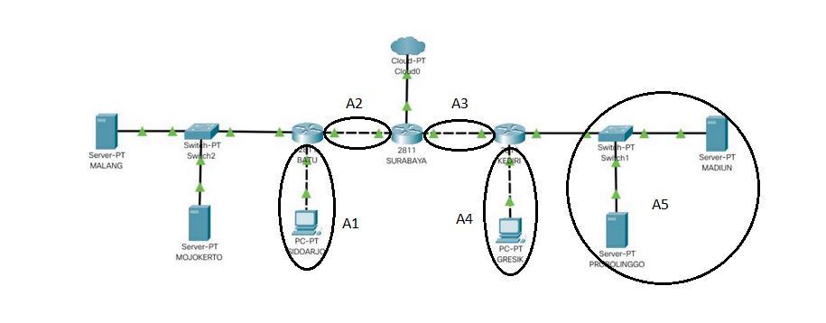
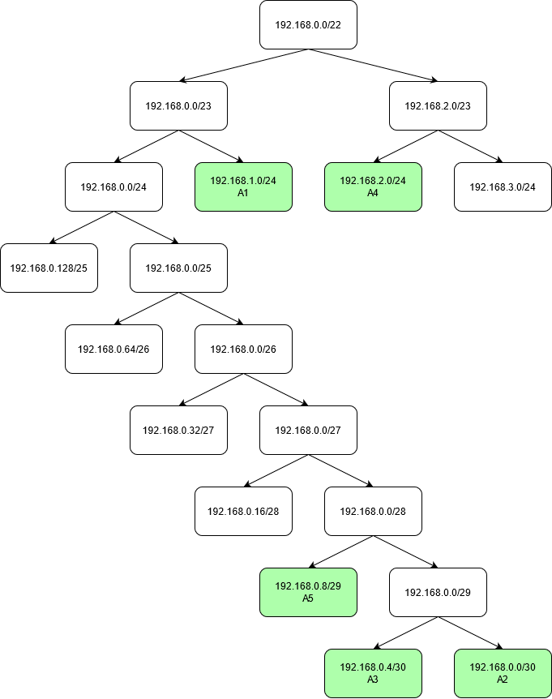
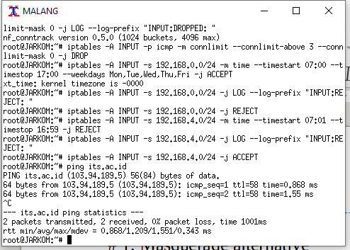
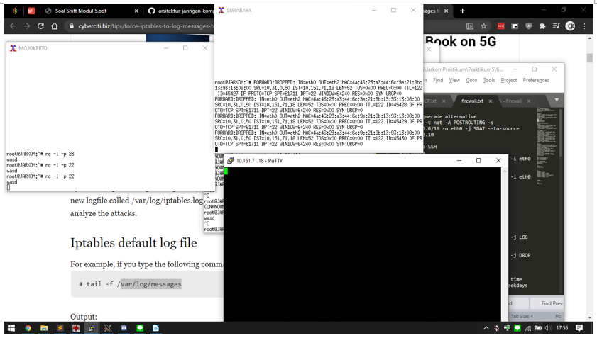
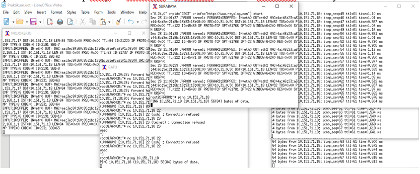
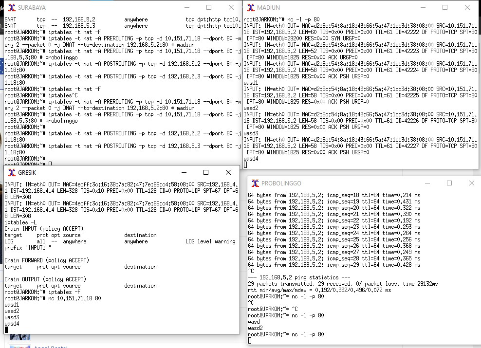
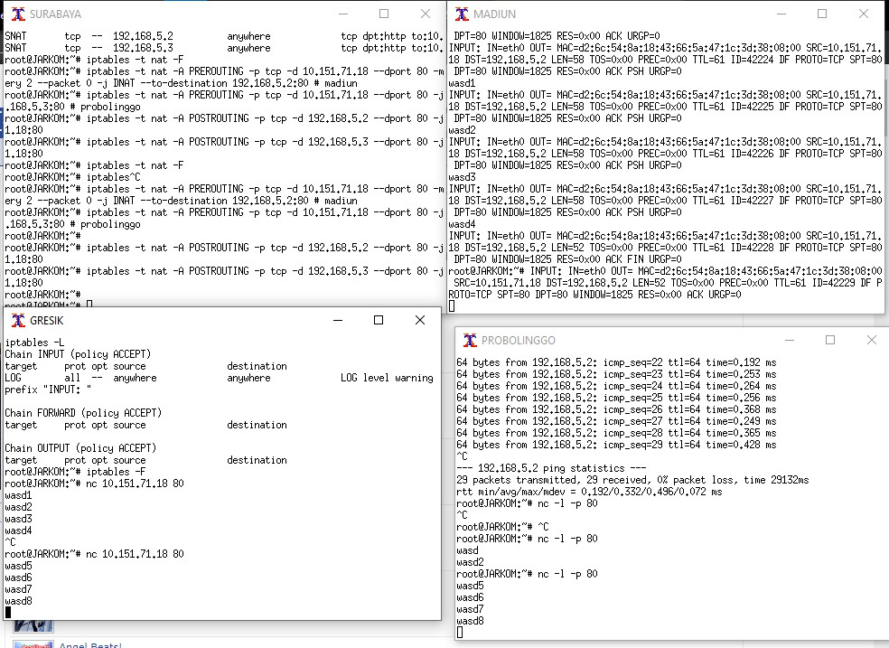

# Jarkom_Modul5_Lapres_E1
## A. Topologi
```
# Switch
uml_switch -unix switch1 > /dev/null < /dev/null &
uml_switch -unix switch2 > /dev/null < /dev/null &
uml_switch -unix switch3 > /dev/null < /dev/null &
uml_switch -unix switch4 > /dev/null < /dev/null &
uml_switch -unix switch5 > /dev/null < /dev/null &
uml_switch -unix switch6 > /dev/null < /dev/null &

# Router
xterm -T SURABAYA -e linux ubd0=SURABAYA,jarkom umid=SURABAYA eth0=tuntap,,,10.151.70.9 eth1=daemon,,,switch6 eth2=daemon,,,switch5 mem=96M &
xterm -T KEDIRI -e linux ubd0=KEDIRI,jarkom umid=KEDIRI eth0=daemon,,,switch6 eth1=daemon,,,switch1 eth2=daemon,,,switch4 mem=96M &
xterm -T BATU -e linux ubd0=BATU,jarkom umid=BATU eth0=daemon,,,switch2 eth1=daemon,,,switch5 eth2=daemon,,,switch3 mem=96M &

# Server
xterm -T MALANG -e linux ubd0=MALANG,jarkom umid=MALANG eth0=daemon,,,switch2 mem=128M &
xterm -T MOJOKERTO -e linux ubd0=MOJOKERTO,jarkom umid=MOJOKERTO eth0=daemon,,,switch2 mem=128M &
xterm -T MADIUN -e linux ubd0=MADIUN,jarkom umid=MADIUN eth0=daemon,,,switch1 mem=128M &
xterm -T PROBOLINGGO -e linux ubd0=PROBOLINGGO,jarkom umid=PROBOLINGGO eth0=daemon,,,switch1 mem=128M &

# Client
xterm -T GRESIK -e linux ubd0=GRESIK,jarkom umid=GRESIK eth0=daemon,,,switch4 mem=96M &
xterm -T SIDOARJO -e linux ubd0=SIDOARJO,jarkom umid=SIDOARJO eth0=daemon,,,switch3 mem=96M &
```

## B. Subnetting VLSM




Pada file `/etc/network/interfaces`

**[SURABAYA]**
```
auto eth0
iface eth0 inet static
address 10.151.70.10
netmask 255.255.255.252
gateway 10.151.70.9

auto eth1
iface eth1 inet static
address 192.168.6.1
netmask 255.255.255.252

auto eth2
iface eth2 inet static
address 192.168.1.1
netmask 255.255.255.252
```

**[KEDIRI]**
```
auto eth0
iface eth0 inet static
address 192.168.6.2
netmask 255.255.255.252
gateway 192.168.6.1

auto eth1
iface eth1 inet static
address 192.168.5.1
netmask 255.255.255.248

auto eth2
iface eth2 inet static
address 192.168.4.1
netmask 255.255.255.0
```

**[BATU]**
```
auto eth0
iface eth0 inet static
address 10.151.71.17
netmask 255.255.255.248

auto eth1
iface eth1 inet static
address 192.168.1.2
netmask 255.255.255.252
gateway 192.168.1.1

auto eth2
iface eth2 inet static
address 192.168.0.1
netmask 255.255.255.0
```

**[MALANG]**
```
auto eth0
iface eth0 inet static
address 10.151.71.19
netmask 255.255.255.0
gateway 10.151.71.17
```

**[MOJOKERTO]**
```
auto eth0
iface eth0 inet static
address 10.151.71.18
netmask 255.255.255.0
gateway 10.151.71.17
```

**[MADIUN]**
```
auto eth0
iface eth0 inet static
address 192.168.5.2
netmask 255.255.255.248
gateway 192.168.5.1
```

**[PROBOLINGGO]**
```
auto eth0
iface eth0 inet static
address 192.168.5.3
netmask 255.255.255.248
gateway 192.168.5.1
```

## C. Routing
Routing di SURABAYA
```
ip route add 192.168.0.0/24 via 192.168.1.2 dev eth2
ip route add 192.168.4.0/23 via 192.168.6.2 dev eth1
ip route add 10.151.71.16/29 via 192.168.1.2 dev eth2
```

## D. DHCP

File `/etc/network/interfaces`

**[SIDOARJO]**
```
auto eth0
iface eth0 inet dhcp
```

```
#MOJOKERTO
subnet 10.151.71.16 netmask 255.255.255.248 {
    option routers 10.151.71.17;
    option broadcast-address 10.151.71.23;
}

#GRESIK
subnet 192.168.4.0 netmask 255.255.255.0 {
    range 192.168.4.2 192.168.4.254;
    option routers 192.168.4.1;
    option broadcast-address 192.168.4.255;
    option domain-name-servers 10.151.71.19;
    option domain-name-servers 202.46.129.2;
    default-lease-time 600;
    max-lease-time 7200;
}

#SIDOARJO
subnet 192.168.0.0 netmask 255.255.255.0 {
    range 192.168.0.2 192.168.0.254;
    option routers 192.168.0.1;
    option broadcast-address 192.168.0.255;
    option domain-name-servers 10.151.71.19;
    option domain-name-servers 202.46.129.2;
    default-lease-time 600;
    max-lease-time 7200;
}
```

## 1. SURABAYA dapat mengakses keluar tanpa MASQUERADE
Ditambah perintah di SURABAYA
```
iptables -t nat -A POSTROUTING -s 192.168.0.0/16 -o eth0 -j SNAT --to-source 10.151.70.10 
```

## 2. Drop semua akses SSH dari luar Topologi pada DHCP dan DNS SERVER
Ditambah perintah di SURABAYA
```
#SURABAYA
iptables -A FORWARD -d 10.151.71.16/29 -i eth0 -p tcp --dport 22 -j LOG --log-prefix "FORWARD:DROPPED: "
iptables -A FORWARD -d 10.151.71.16/29 -i eth0 -p tcp --dport 22 -j DROP 
```

## 3. DHCP dan DNS server hanya boleh menerima maksimal 3 koneksi ICMP secara bersamaan
Ditambah perintah di MALANG dan MOJOKERTO
```
#Server
iptables -A INPUT -p icmp -m connlimit --connlimit-above 3 --connlimit-mask 0 -j LOG --log-prefix "INPUT:DROPPED: "
iptables -A INPUT -p icmp -m connlimit --connlimit-above 3 --connlimit-mask 0 -j DROP 
```

## 4. SIDOARJO hanya diperbolehkan pukul 07.00-17.00 hari Senin-Jumat
Ditambah perintah di SIDOARJO
```
#SIDOARJO
iptables -A INPUT -s 192.168.0.0/24 -m time --timestart 07:00 --timestop 17:00 --weekdays Mon,Tue,Wed,Thu,Fri -j ACCEPT
iptables -A INPUT -s 192.168.0.0/24 -j LOG --log-prefix "INPUT:REJECT: "
iptables -A INPUT -s 192.168.0.0/24 -j REJECT
```
## 5. GRESIK hanya diperbolehkan pukul 17.00-07.00 setiap hari
Ditambah perintah di GRESIK
```
#GRESIK
iptables -A INPUT -s 192.168.4.0/24 -m time --timestart 07:01 --timestop 16:59 -j LOG --log-prefix "INPUT:REJECT: "
iptables -A INPUT -s 192.168.4.0/24 -m time --timestart 07:01 --timestop 16:59 -j REJECT
iptables -A INPUT -s 192.168.4.0/24 -j ACCEPT
```
## 6. Mengakses DNS Server didistribusikan bergantian pada PROBOLINGGO port 80 dan MADIUN port 80
Ditambah perintah sebagai berikut
```
#SURABAYA
iptables -t nat -A PREROUTING -p tcp -d 10.151.71.18 --dport 80 -m statistic --mode nth --every 2 --packet 0 -j DNAT --to-destination 192.168.5.2:80 

#MADIUN
iptables -t nat -A PREROUTING -p tcp -d 10.151.71.18 --dport 80 -j DNAT --to-destination 192.168.5.3:80 

#PROBOLINGGO
iptables -t nat -A POSTROUTING -p tcp -d 192.168.5.2 --dport 80 -j SNAT --to-source 10.151.71.18:80
iptables -t nat -A POSTROUTING -p tcp -d 192.168.5.3 --dport 80 -j SNAT --to-source 10.151.71.18:80

```




## 7. Log semua paket yang didrop
```
#SURABAYA
iptables -N LOGGING
iptables -A INPUT -j LOGGING
iptables -A OUTPUT -j LOGGING
iptables -A LOGGING -j LOG --log-prefix "IPTables-Dropped: " --log-level 4
iptables -A LOGGING -j DROP
```


